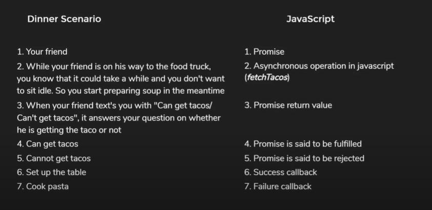

# Async JS Notes - Codevolution

Playlist Link : </br>
<https://www.youtube.com/watch?v=exBgWAIeIeg&t=194s>

</br>

---

## Async JS

- JavaScript is a **synchronous**, **blocking**, **single-threaded** language
  Synchronous

- _Synchronous_:
  If we have two functions which log messages to the console, code
  executes top down, with only one ine executing at any given time

- _Blocking_:
  No matter how long a previous process takes, the subsequent processes
  won't kick off until the former is completed.
  If function A had to execute an intensive chunk of code, JavaScript has to
  finish that without moving on to function B. Even if that code takes 10
  seconds or 1 minute.
  Web app runs in a browser and it executes an intensive chunk of code
  without returning control to the browser, the browser can appear to be
  frozen
- _Single-threaded_:
  A thread is simply a process that your JS program can use to run a task. E ach thread can only do one task at a time. JS has only one thread called the main thread for executing any code.

  </br>

---

## Examples of async JS

```javascript
1) setTimeout(), setInterval()
2) addEventListener()
3) callbacks, Promises, async-await
```

</br>

---

## Timeouts & Intervals

```javascript
1. Timers and intervals are not part of JavaScript itself. They are implemented by the browser
and setTimeout and setinterval are basically names given to that functionality in JavaScript
2. duration parameter is the minimum delay, not guaranteed delay
```

</br>

---

## Callbacks

```javascript
Any function that is passed as an argument to another function is called a callback
function in JavaScript
The function which accepts a function as an argument or returns a function is called a
higher order function
```

## Callback Hell

```javascript
Problem with the callbacks pattern:
If you have multiple callback functions where each level depends on the result obtained from the previous level, the nesting of functions becomes so deep that the code becomes difficult to read and maintain

Callback hell

fetchCurrentUser (" api/user, function (result) {
    fetchFollowersByUserId (" api/followers/${result. userId), function (result){
        fetchFollowerInterests( api/interests/${result. follower Id), function(result) {
            fetchInterestTags ( api/tags/S{result. interestId), function (result) {
                fetchTagDescript ion( api/description/s{result.tagId), function (result) {//Finally display the data
            })
        })
    })
})
```

## Callback Hell -> solution in the Promises

</br>

---

## Promises

Example: <br>
Promise in layman terms - Dinner Scenario <br>
Consider a scenario where you and your roommate want to have dinner at home <br>
You want to prepare your special soup <br>
At the same time, you feel like having tacos from the food truck nearby<br>
You ask your roommate, "hey can you go down to the food truck and get us some tacos?<br>
When he is about to leave, you tell him<br>
There is no point in me waiting till you're back to prepare the soup. So I'll start with the soup now but
when you reach the place, can you promise that you'll text me so I can start setting up the dining table?<br>
"Also let me know if something goes wrong. If you can't find the food truck or if they are out of tacos for
the night. Let me know that you cant get the tacos and I'll start cooking some pasta instead"<br>
Your friend says "Sure, I promise. I'll head out now and text you in some time."<br>
Now, you go about preparing your soup but the status on tacos? We can say that it is currently pending till
you receive that message from your friend<br>
When you get back a text message saying that he is getting the tacos, your desire to eat tacos has been fulfilled. You can then proceed to set up the table<br>
the text.message says that he can't bring back any tacos, your desire to have tacos have been rejected and you now have to cook some pasta instead

<br>



```javascript
// How to create a promise?
const promise = new Promise();

// How to fulfill or reject the promise?
/* Promise constructor accepts one function with 2 parameters, resolve and reject which are both functions*/

const promise = new Promise((resolve, reject) => {
  // Change status from 'pending' to 'fulfilled'
  resolve();
});

const promise = new Promise((resolve, reject) => {
  // Change status from 'pending' to 'rejected'
  reject();
});

// both of these function, resolve and reject are typically called after an async operation
const promise = new Promise((resolve, reject) => {
  setTimeout(() => {
    // Food truck found,
    // Change status from pending' to 'fulfilled
    resolve();
  }, 5000);
});
// How to execute callback functions based on whether the Promise is fulfilled or rejected?
/*Callback functions*/
const onFulfillment = () => {
  // resolve was called
  console.log("Set up the table to eat tacos");
};
const onRejection = () => {
  // reject was called
  console.log("Start cooking pasta");
};
/*Promise has 2 methods, then() and catch() which accepts the callback functions (as we said callback functions are functions that is passed to another functions as parameters)*/

// Resolve scenariio
const promise = new Promise ((resolve, reject) => {
setTimeout (() => {
// Food truck found
// Change status from 'pending to 'fulfilled
resolve()
}, 5000)
})

// Reject scenario
const promise = new Promi se ( (resolve, reject) => {
setTimeout (() => {
// Food truck not found
// Change status fram pending' to 'rejected'
reject ()
 }, 5000)
 })

promise. then(onFulfillment);
promise. catch(onRejection);

// To send arguments to callback functions pass them through resolve or reject

// Chaining promises:
Both then and catch methods return promises
then() and catch() methods can be chained in
JavaScript

promise.then (onFulfillment) .catch (onRejection)
```

</br>

---

## Async Await

async: <br>

- The async keyword is used to declare async functions
- Async functions are functions that are instances of the AsyncFunction constructor
- Unlike normal functions, async functions always return a promise

await: <br>

- await keyword can be put infront of any async promise based function to pause
  your code until that promise settles and returns its result
- await only works inside async functions. Cannot use await in normal functions

```javascript
async function greet () {
let promise = new Promise ( (resolve, reject) => {
setTimeout ( () => resolve ( "Hello"), 1000)
});
let result = await promise; // wait until the promise resolves ()
console.log (result); // "Hello"
greet()
```

</br>

---
